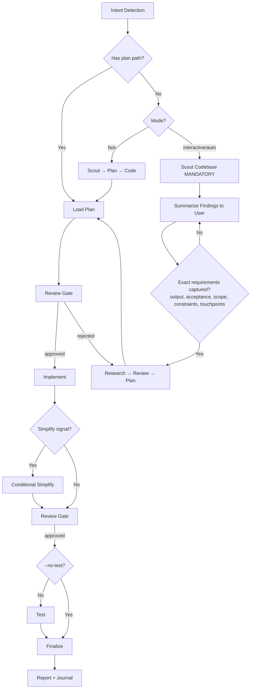

# Cook - Smart Feature Implementation

End-to-end implementation with automatic workflow detection.

**Principles:** YAGNI, KISS, DRY | Token efficiency | Concise reports

## Usage

```
/hs:cook <natural language task OR plan path>
```

**IMPORTANT:** If no flag is provided, the skill will use the `interactive` mode by default for the workflow.

**Optional flags to select the workflow mode:**

- `--interactive`: Full workflow with user input (**default**)
- `--fast`: Skip research, scout→plan→code
- `--parallel`: Multi-agent execution
- `--no-test`: Skip testing step
- `--auto`: Auto-approve all steps

**Composable flags** (combine with any mode):

- `--tdd`: Tests-first per phase — write tests for current behavior before
  refactoring, then verify they still pass after the implementation step

**Example:**

```
/hs:cook "Add user authentication to the app" --fast
/hs:cook path/to/plan.md --auto
/hs:cook "Refactor auth middleware" --tdd
```

<HARD-GATE>
Do NOT write implementation code until a plan exists and has been reviewed.
This applies regardless of task simplicity. "Simple" tasks are where unexamined assumptions waste the most time.
Exception: `--fast` mode skips research but still requires a plan step.
User override: If user explicitly says "just code it" or "skip planning", respect their instruction.
</HARD-GATE>

<HARD-GATE-SCOUT-FIRST>
Before planning OR asking clarifying questions, scan the codebase. Mandatory scout outputs:
1. Project type, language(s), framework(s)
2. Existing modules/files relevant to the task
3. Current patterns/conventions for similar features (so the implementation matches them)
4. Existing docs in `./docs/` and any in-flight plans in `./plans/` covering this area
5. Public APIs, schemas, contracts that the task could affect

State a 3-6 bullet codebase-context summary to the user before asking questions. Skip ONLY when input is a `plan.md`/`phase-*.md` path (the plan already encodes scout output).

Shared pattern/rationale: `../_shared/scout-first.md`.
</HARD-GATE-SCOUT-FIRST>

<HARD-GATE-EXACT-REQUIREMENTS>
Before producing a plan, you MUST be able to answer ALL 5 mandatory items in one concrete sentence each (use `ask_user capability` to pin them down — do NOT proceed on vague intent). Items + grounding rule: `../_shared/exact-requirements.md`.

Delta: skip this gate ONLY when input is a `plan.md`/`phase-*.md` path (the plan already encodes these answers).
</HARD-GATE-EXACT-REQUIREMENTS>

<HARD-GATE-NO-SIDE-EFFECTS>
Implementation is NOT done until verified to be side-effect-free. 5 proof obligations + escalation procedure: `../_shared/no-side-effects.md`.

Delta: if user invoked `--no-test`, item 2 (tests pass) is downgraded to a warning — surfaced at finalize `ask_user capability`, not silently skipped. Items 1, 3, 4, 5 remain enforceable via the mandatory `code-reviewer` subagent.
</HARD-GATE-NO-SIDE-EFFECTS>

## Anti-Rationalization

| Thought                         | Reality                                                                   |
| ------------------------------- | ------------------------------------------------------------------------- |
| "This is too simple to plan"    | Simple tasks have hidden complexity. Plan takes 30 seconds.               |
| "I already know how to do this" | Knowing ≠ planning. Write it down.                                        |
| "Let me just start coding"      | Undisciplined action wastes tokens. Plan first.                           |
| "The user wants speed"          | Fastest path = plan → implement → done. Not: implement → debug → rewrite. |
| "I'll plan as I go"             | That's not planning, that's hoping.                                       |
| "Just this once"                | Every skip is "just this once." No exceptions.                            |

## Smart Intent Detection

| Input Pattern                     | Detected Mode | Behavior                       |
| --------------------------------- | ------------- | ------------------------------ |
| Path to `plan.md` or `phase-*.md` | code          | Execute existing plan          |
| Contains "fast", "quick"          | fast          | Skip research, scout→plan→code |
| Contains "trust me", "auto"       | auto          | Auto-approve all steps         |
| Lists 3+ features OR "parallel"   | parallel      | Multi-agent execution          |
| Contains "no test", "skip test"   | no-test       | Skip testing step              |
| Default                           | interactive   | Full workflow with user input  |

See `references/intent-detection.md` for detection logic.

If the task needs a cross-skill workflow sequence decision after intent
detection, load `references/workflow-routing.md`.

## Process Flow (Authoritative)



**This diagram is the authoritative workflow.** Prose sections below provide detail for each node. If prose conflicts with this flow, follow the diagram.

## Workflow Overview

```
[Intent Detection] → [Research?] → [Review] → [Plan] → [Review] → [Implement] → [Conditional Simplify?] → [Review] → [Test?] → [Review] → [Finalize]
```

**Default (non-auto):** Stops at `[Review]` gates for human approval before each major step.
**Auto mode (`--auto`):** Skips human review gates, implements all phases continuously.
**Claude Tasks:** Utilize the `manage_plan` task-management tool (create/update/read/list operations) during the implementation step. **Fallback:** It is CLI-only — unavailable in the VSCode extension. If it errors, track progress in the plan files directly. Full hydrate/sync-back doctrine: `../_shared/task-hydration.md`.

| Mode        | Research | Testing | Review Gates                   | Phase Progression      |
| ----------- | -------- | ------- | ------------------------------ | ---------------------- |
| interactive | ✓        | ✓       | **User approval at each step** | One at a time          |
| auto        | ✓        | ✓       | Auto if score≥9.5              | All at once (no stops) |
| fast        | ✗        | ✓       | **User approval at each step** | One at a time          |
| parallel    | Optional | ✓       | **User approval at each step** | Parallel groups        |
| no-test     | ✓        | ✗       | **User approval at each step** | One at a time          |
| code        | ✗        | ✓       | **User approval at each step** | Per plan               |

## Step Output Format

```
✓ Step [N]: [Brief status] - [Key metrics]
```

## Blocking Gates (Non-Auto Mode)

Human review required at these checkpoints (skipped with `--auto`):

- **Post-Research:** Review findings before planning
- **Post-Plan:** Approve plan before implementation
- **Post-Implementation:** Approve code before testing
- **Post-Testing:** 100% pass + approve before finalize

**Always enforced (all modes):**

- **Testing:** 100% pass required (unless no-test mode)
- **Code Review (MANDATORY):** Spawn `code-reviewer` subagent using the canonical (a)-(e) delegation prompt and loop logic in `../_shared/review-cycle.md`. Pass scout summary + acceptance criteria as context. If reviewer flags side effects → trigger HARD-GATE-NO-SIDE-EFFECTS (`ask_user capability` with 2-4 options).
  Then: User approval OR auto-approve (score≥9.5, 0 critical).
- **Finalize (MANDATORY - never skip):**
  1. **Activate `the engineer project-management skill` skill (MANDATORY)** → run full plan sync-back across ALL `phase-XX-*.md` (not only current phase), update `plan.md` status/progress, hydrate Claude Tasks, generate progress report
  2. `docs-manager` subagent → update `./docs` if changes warrant
  3. `manage_plan capability` → mark all Claude Tasks complete after sync-back verification (skip if parent coordinator tools unavailable)
  4. Ask user if they want to commit via `git-manager` subagent
  5. Run `/hs:journal` to write a concise technical journal entry upon completion

## Required Subagents (MANDATORY)

| Phase    | Subagent                                                                                | Requirement           |
| -------- | --------------------------------------------------------------------------------------- | --------------------- |
| Research | `researcher`                                                                            | Optional in fast/code |
| Scout    | `hs:scout`                                                                              | Optional in code      |
| Plan     | `planner`                                                                               | Optional in code      |
| UI Work  | `ui-ux-designer`                                                                        | If frontend work      |
| Testing  | `tester`, `debugger`                                                                    | **MUST** spawn        |
| Review   | `code-reviewer`                                                                         | **MUST** spawn        |
| Finalize | `the engineer project-management skill` skill + `docs-manager`, `git-manager` subagents | **MUST** invoke all   |

**CRITICAL ENFORCEMENT:**

- Steps 4, 5, 6 **MUST** use parent coordinator tool to spawn subagents
- DO NOT implement testing, review, or finalization yourself - DELEGATE
- If workflow ends with 0 parent coordinator tool calls, it is INCOMPLETE
- Pattern: `delegate_agent capability(subagent_type="[type]", prompt="[task]", description="[brief]")`

## References

- `references/intent-detection.md` - Detection rules and routing logic
- `references/workflow-routing.md` - Cross-skill sequence routing for ambiguous workflows
- `references/workflow-steps.md` - Detailed step definitions for all modes
- `../_shared/review-cycle.md` - Interactive and auto review processes, canonical delegation prompt
- `references/subagent-patterns.md` - Subagent invocation patterns

## Workflow Position

**Typically follows:** `hs:plan` (execute a plan), `/hs:brainstorm` (implement agreed solution)
**Typically precedes:** `hs:code-review` (review after implementation), `hs:test` (validate changes)
**Related:** `/hs:fix` (alternative for bug fixes), `hs:plan` (create plan before cooking)
