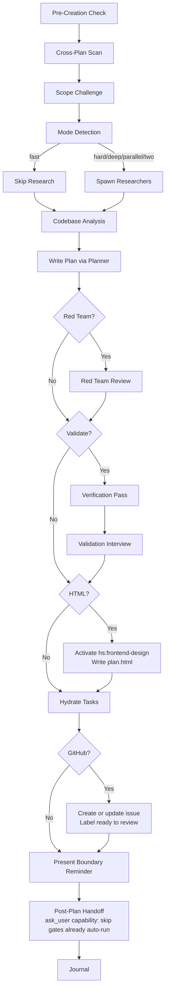

# Planning

Create detailed technical implementation plans through research, codebase analysis, solution design, and comprehensive documentation.

## Plan File Scaffolding

This skill creates and maintains plan files directly with Write/Edit. Plan and phase files are plain Markdown — no external CLI owns scaffolding or status mutations. Use the Canonical Phase File Template below to scaffold `plan.md` and each `phase-*.md`; hand-edit the phases table and phase-file frontmatter/checkboxes for status changes.

Rules:

- When `--html` is present, the final user-facing plan artifact is `plan.html`.
  A companion `plan.md` index is written only when a `--github` link or
  cook-handoff compatibility needs it. Do not duplicate the full plan body
  across Markdown and HTML.
- Default scope is project-local (`./plans/` under the current project).
- Global scope is conditional: use the configured global plans root only when the user asks for global planning or no project context exists.
- Hand-edit the phases table and each phase file's `status` frontmatter/checkboxes directly for status toggles or structural updates — this is the only path.
- **Read-before-Write caution:** Claude Code enforces Read-before-Write on existing files. If `plan.md` or any `phase-*.md` already exists (for example, from a prior session or a partial run), read it before composing a long replacement Write — skipping that read causes the Write to be rejected after wasting the full payload. A directory listing is not a substitute for a read. When creating brand-new files, no prior read is needed.

### Canonical Phase File Template

Use this structure when filling each `phase-XX-*.md`. Loaded once with the skill — no per-file Read needed to learn it. Frontmatter fields match the phase schema below; section headers match `documentation-management.md` so phase files stay consistent across plans.

```markdown
---
phase: <N>
title: "<Phase Name>"
status: pending # pending | in-progress | completed
priority: P2 # P1 | P2 | P3
effort: "" # e.g. "4h", "2d"
dependencies: [] # phase IDs this blocks on
---

# Phase <id>: <Name>

## Overview

<1-2 sentences describing what this phase delivers>

## Requirements

- Functional: ...
- Non-functional: ...

## Architecture

<Design, data flow, component interactions>

## Related Code Files

- Create: `path/...`
- Modify: `path/...`
- Delete: `path/...`

## Implementation Steps

1. ...
2. ...

## Success Criteria

- [ ] ...

## Risk Assessment

<Risks + mitigations>
```

**IMPORTANT:** Before you start, scan unfinished plans in the active scope first:

- Project scope: `./plans/`
- Global scope: the configured global plans root
  - Default when unset: `~/.agents/plans/`

If there are relevant plans overlapping your upcoming plan, update them as well. If you're unsure or need more clarifications, use `ask_user capability` tool to ask the user.

### Scope Selection

- **Project scope** is the default whenever the current working tree has project context.
- **Global scope** is allowed only when:
  - the user explicitly asks for it via `--global`, or
  - there is no project context to anchor a local plan.
- **No project context** means no `.git`, `package.json`, or `CLAUDE.md` was found in the ancestor chain.
- Keep scope honest in prose and examples: the skill resolves scope itself via the rules above, not through any external tool.

### Cross-Plan Dependency Detection

During the pre-creation scan, detect and mark blocking relationships between plans:

1. **Scan** — Read `plan.md` frontmatter of each unfinished plan (status != `completed`/`cancelled`)
2. **Compare scope** — Check overlapping files, shared dependencies, same feature area
3. **Classify relationship:**
   - New plan needs output of existing plan → new plan `blockedBy: [existing-plan-dir]`
   - New plan changes something existing plan depends on → existing plan `blockedBy: [new-plan-dir]`, new plan `blocks: [existing-plan-dir]`
   - Cross-scope dependency → use `global:` or `project:` prefixes
   - Mutual dependency → both plans reference each other in `blockedBy`/`blocks`
4. **Bidirectional update** — When relationship detected, update BOTH `plan.md` files' frontmatter
5. **Ambiguous?** → Use `ask_user capability` with header "Plan Dependency", present detected overlap, ask user to confirm relationship type (blocks/blockedBy/none)

**Frontmatter fields**:

```yaml
blockedBy: [260301-1200-auth-system]            # Same-scope dependency
blockedBy: [global:260301-1200-auth-system]     # Cross-scope dependency
blocks: [project:260228-0900-user-dashboard]    # Explicit project-scope dependency
```

**Status interaction:** Read the target plan's `plan.md` frontmatter directly to inspect resolved dependency state. Same-scope bare refs stay in the current scope; prefixed refs resolve against the explicit project/global root. Missing refs should warn and show `not found`, not hard-fail the plan.

## Default (No Arguments)

If invoked with a task description, proceed with planning workflow. If invoked WITHOUT arguments or with unclear intent, use `ask_user capability` to present available operations:

| Operation   | Description                           |
| ----------- | ------------------------------------- |
| `(default)` | Create implementation plan for a task |
| `archive`   | Write journal entry & archive plans   |
| `red-team`  | Adversarial plan review               |
| `validate`  | Critical questions interview          |

Present as options via `ask_user capability` with header "Planning Operation", question "What would you like to do?".

## Workflow Modes

Default: auto-detect planning mode (analyze task complexity and pick mode).

| Flag         | Mode           | Research                          | Red Team        | Validation      | Cook Flag    |
| ------------ | -------------- | --------------------------------- | --------------- | --------------- | ------------ |
| `--auto`     | Auto-detect    | Follows mode                      | Follows mode    | Follows mode    | Follows mode |
| `--fast`     | Fast           | Skip                              | Skip            | Skip            | (none)       |
| `--hard`     | Hard           | 2 researchers                     | Yes             | Optional        | (none)       |
| `--deep`     | Deep           | 2-3 researchers + per-phase scout | Yes             | Yes             | (none)       |
| `--parallel` | Parallel       | 2 researchers                     | Yes             | Optional        | `--parallel` |
| `--two`      | Two approaches | 2+ researchers                    | After selection | After selection | (none)       |

**Composable flags** (combine with any mode):
| Flag | Effect |
|------|--------|
| `--tdd` | Add tests-first structure to each phase for regression-safe refactors |
| `--no-tasks` | Skip task hydration |
| `--html` | Output a self-contained editorial interactive HTML plan with visible phase outlines, markdown detail modals, and optional generated watercolor technical sketch imagery |
| `--github` | Create or update a GitHub issue after plan validation with branch, summary, plan links, open questions, and `ready to review` |

### HTML Output Mode (`--html`)

When `--html` is present, activate `/hs:frontend-design` before composing the
HTML artifact. If `hs:frontend-design` requires design intelligence, follow its
`hs:ui-ux-pro-max` activation rule before styling.

**Artifact rules:**

- Write the primary output as `plan.html` in the selected plan directory.
- The HTML file must be self-contained: inline CSS and JavaScript, no build
  step, no network-required assets.
- If generated image assets are used, embed selected images as data URIs so
  `plan.html` remains portable; keep source images under `{plan-dir}/assets/`
  for review only.
- Generate `plan.html` after red-team and validation gates so the HTML reflects
  the final reviewed plan. Markdown files produced for scaffolding or gate
  compatibility are not the user-facing deliverable in this mode.
- If another workflow requires `plan.md` (for example `--github`), keep
  `plan.md` as a concise index that points to `plan.html`; do not duplicate the
  full plan body unless a downstream `/hs:cook` handoff explicitly needs it.
- Include accessible responsive UI, keyboard-friendly controls, and reduced
  motion handling.

**Content requirements:**

- Plan overview and phase roadmap.
- Main page must show a concise outline summary for every phase: title, status,
  priority, dependencies, objective, 3-6 key bullets, related files,
  success criteria highlights, and test/validation gate when known.
- Each phase outline must open a detail modal rendering the full phase markdown:
  headings, lists, checkboxes, tables, fenced code, inline code, blockquotes,
  links, horizontal rules, and frontmatter metadata. Escape raw HTML unless a
  trusted sanitizer is bundled inline.
- User flows.
- Diagrams and charts rendered directly in HTML/CSS/SVG/Canvas.
- Interactive affordances such as tabs, filters, expandable risks, or chart
  toggles when useful.
- Citations as visible URLs for external sources, GitHub issues, docs, and
  any web references used.
- Open questions section; write "None" when there are no unresolved questions.

**Generated illustration requirements:**

- If `imagegen`, built-in `image_gen`, or `create_image` is available, generate
  1-3 raster illustrations for the HTML.
- Prompt style: technical sketch, watercolor wash, hand-drawn engineering
  notebook, ink linework, warm paper, muted red/gold accents, no text, no logo,
  no watermark.
- If image generation is unavailable or fails, continue with typographic
  diagrams / CSS-only structure and state the limitation in the final response.

**Design direction:**

- Use the editorial magazine style contract from the user's supplied guideline
  when present; otherwise use this built-in contract.
- Use warm paper `#faf7f2`, paper panels `#f0ebe1`, ink `#0a0a0a`, muted
  `#6b6258`, accent red `#b8232c`, hairline dividers, serif display, mono
  labels, and restrained sans body.
- Use print-editorial structure: cover section, running mono slide tags/folios,
  generous whitespace, asymmetric grids, rule lines, pull quotes, stat bands,
  and fixed nav dots when useful.
- Avoid gradients, drop shadows, rounded cards, pure white backgrounds, generic
  SaaS styling, decorative bokeh/orbs, emoji icons, and hidden instructions.
- Use accent only for italic serif emphasis, eyebrows, active states, left
  rules, and small data highlights. Include subtle CSS paper grain.
- Keep typography readable on mobile and desktop; no horizontal scrolling.

### GitHub Issue Mode (`--github`)

When `--github` is present, create or update a GitHub issue after validation and
red-team gates finish and before implementation handoff.

**Required issue fields:**

- Branch name from `git branch --show-current`.
- Plan summary.
- Repo-relative link to `plan.md`.
- Repo-relative link to `plan.html` when `--html` is present.
- Repo-relative link to the brainstorm report when one exists; otherwise state
  `Brainstorm report: None found`.
- Open questions when present; otherwise state `Open questions: None`.
- Acceptance criteria from the validated plan.

**Required label:** `ready to review`.

hs-vibe lifecycle labels (`ready to cook`, `in progress`, `ready to ship *`) are
owned by hs-vibe; `ready to review` marks a
plan-awaiting-human-review stage before `ready to cook`.

**Issue creation rules:**

```bash
gh label list --json name --jq '.[].name' | grep -Fx "ready to review" >/dev/null \
  || gh label create "ready to review" --color "C5DEF5" --description "Plan ready for human review"
gh issue create --title "<plan title>" --body-file "<body.md>" --label "ready to review"
```

- If an issue already exists for the same plan or branch, update/comment on it
  instead of creating a duplicate.
- All links posted to GitHub must be repo-relative. Do not post absolute local
  filesystem paths.
- Redact secrets, env values, tokens, customer data, private logs, and local
  machine-specific details before writing issue bodies or comments.
- If `gh` cannot create labels or issues, stop and report the exact error.

### Combined `--html --github`

`plan.html` is the authoritative plan. Create a short companion `plan.md` index
only to satisfy the GitHub issue's stable `plan.md` link requirement. The issue
must include both relative links.

Load: `references/workflow-modes.md` for auto-detection logic, per-mode workflows, context reminders.

## When to Use

- Planning new feature implementations
- Architecting system designs
- Evaluating technical approaches
- Creating implementation roadmaps
- Breaking down complex requirements

## Core Responsibilities & Rules

Always honoring **YAGNI**, **KISS**, and **DRY** principles.
**Be honest, be brutal, straight to the point, and be concise.**

### 0. Scope Challenge

Load: `references/scope-challenge.md`
**Skip if:** `--fast` mode or trivial task (single file fix, <20 word description)

### 1. Research & Analysis

Load: `references/research-phase.md`
**Skip if:** Fast mode or provided with researcher reports

### 2. Codebase Understanding

Load: `references/codebase-understanding.md`
**Skip if:** Provided with scout reports

### 3. Solution Design

Load: `references/solution-design.md`

### 4. Plan Creation & Organization

Load: `references/plan-organization.md`

### 5. parent coordinator Breakdown & Output Standards

Load: `references/output-standards.md`

## Process Flow (Authoritative)



**This diagram is the authoritative workflow.** Prose sections below provide detail for each node.

## Workflow Process

1. **Pre-Creation Check** → Check Plan Context for active/suggested/none
   1b. **Cross-Plan Scan** → Scan unfinished plans, detect `blockedBy`/`blocks` relationships, update both plans
   1c. **Scope Challenge** → Run Step 0 scope questions, select mode (see `references/scope-challenge.md`)
   **Skip if:** `--fast` mode or trivial task
2. **Mode Detection** → Auto-detect or use explicit flag (see `workflow-modes.md`)
3. **Research Phase** → Spawn researchers (skip in fast mode)
4. **Codebase Analysis** → Read docs, scout if needed
5. **Plan Documentation** → Write comprehensive plan via planner subagent
6. **Red Team Review** → Run `/hs:plan red-team {plan-path}` (hard/deep/parallel/two modes)
7. **Post-Plan Validation** → Run `/hs:plan validate {plan-path}` (hard/deep/parallel/two modes)
8. **HTML Artifact** → If `--html`, activate `/hs:frontend-design` and write final reviewed `plan.html` as the primary output
9. **Hydrate Tasks** → Create Claude Tasks from phases (default on, `--no-tasks` to skip)
10. **GitHub Issue** → If `--github`, create/update issue and apply `ready to review`
11. **Boundary Reminder** → Present optional next-step commands with absolute path
12. **Journal** → Run `/hs:journal` to write a concise technical journal entry upon completion

### Whole-Plan Consistency Gate

This gate is mandatory after `/hs:plan validate` or `/hs:plan red-team` edits any plan file.
Load: `references/verification-roles.md` → "Whole-Plan Consistency Sweep".

Before recommending `/hs:cook`, re-read `plan.md` and every `phase-*.md` file. Search all plan files for stale terms, rejected assumptions, renamed APIs/files/fields, superseded decisions, and duplicate embedded drafts/contracts. Reconcile contradictions across the entire plan, not only the edited phase.

If unresolved contradictions remain, report them and ask the user. Do not recommend cook until the whole-plan consistency sweep reports zero unresolved contradictions.

## Output Requirements

**IMPORTANT:** Invoke the `hs:project-organization` skill to organize the outputs.

- DO NOT implement code - only create plans
- Respond with plan file path and summary
- Ensure self-contained plans with necessary context
- Include code snippets/pseudocode when clarifying
- With `--html`, respond with the `plan.html` path, the companion `plan.md`
  index path when one exists, and a short note that HTML is authoritative.
- With `--github`, respond with the GitHub issue URL and confirm the
  `ready to review` label was applied.
- Fully respect the `./docs/development-rules.md` file

## parent coordinator Management

Plan files = persistent. Tasks = session-scoped. Hydration bridges the gap.

**Default:** Auto-hydrate tasks after plan files are written. Skip with `--no-tasks`.
**3-parent coordinator Rule:** <3 phases → skip task creation.
**Fallback:** The task-management tool (create/update/read/list operations) is CLI-only — unavailable in the VSCode extension. If it errors, track progress in the plan files directly. Plan files remain the source of truth; hydration is an optimization, not a requirement.

Load: `references/task-management.md` for hydration pattern, task-management tool usage, cook handoff protocol.

### Hydration Workflow

1. Write plan.md + phase files (persistent layer)
2. manage_plan capability per phase with `addBlockedBy` chain (skip if parent coordinator tools unavailable)
3. manage_plan capability for critical/high-risk steps within phases (skip if parent coordinator tools unavailable)
4. Metadata: phase, priority, effort, planDir, phaseFile
5. Cook picks up via manage_plan capability (same session) or re-hydrates (new session)

## Active Plan State

Check `## Plan Context` injected by hooks:

- **"Plan: {path}"** → Active plan. Ask "Continue? [Y/n]"
- **"Suggested: {path}"** → Branch hint only. Ask if activate or create new.
- **"Plan: none"** → Create new using `Plan dir:` from `## Naming` (convention: `../_shared/output-naming.md`)

After creating plan: `node {config-dir}/scripts/set-active-plan.cjs {plan-dir}` (`{config-dir}` = `.agents` on Claude Code, `.codex` on Codex)
Reports: Active plans → plan-specific path. Suggested → default path.

### Important

**DO NOT** create plans or reports in arbitrary user directories.
**MUST** create plans or reports in one of these allowed roots:

- project scope → current working project directory
- global scope → configured global plans root
  - Default when unset: `~/.agents/plans/`

## Subcommands

| Subcommand          | Reference                         | Purpose                                         |
| ------------------- | --------------------------------- | ----------------------------------------------- |
| `/hs:plan archive`  | `references/archive-workflow.md`  | Archive plans + write journal entries           |
| `/hs:plan red-team` | `references/red-team-workflow.md` | Adversarial plan review with hostile reviewers  |
| `/hs:plan validate` | `references/validate-workflow.md` | Validate plan with critical questions interview |

## Post-Plan Handoff (MANDATORY at session end)

After `plan.md` + phase files are written and the user has reviewed/approved them, use `ask_user capability` to offer the appropriate next step. Recommend the option that best fits the plan's risk/scope; recommended option listed FIRST and labelled "(Recommended)".

| Option                 | Recommend When                                                                                      | Why                                                                                                  |
| ---------------------- | --------------------------------------------------------------------------------------------------- | ---------------------------------------------------------------------------------------------------- |
| `/hs:plan validate`    | Plan is moderate-to-complex; user wants critical-questions interview before implementation          | Cheapest gate — surfaces unspecified assumptions, missing acceptance criteria, hand-wavy phases      |
| `/hs:plan red-team`    | Plan touches security, auth, payments, data integrity, public APIs, infra, or has high blast radius | Adversarial reviewers stress-test the plan for failure modes, attack vectors, and missing edge cases |
| `/hs:cook <plan-path>` | Plan is small / well-understood / low-risk and user wants to start implementation                   | Skip extra gates; go straight to implementation                                                      |
| End session            | User wants to review/share plan before deciding                                                     | Stop with plan path returned                                                                         |

**Skip this step ONLY when:**

- The current invocation IS already a subcommand (`validate`, `red-team`, `archive`) — those have their own terminal handoff.
- User explicitly said "just plan, don't suggest next step".

**Skip an individual option ONLY when the active mode already auto-ran that gate (per Workflow Process Steps 6-7):**

- Omit `/hs:plan red-team` from the offered options when mode is `--hard`, `--deep`, `--parallel`, or `--two` (Step 6 already ran adversarial review).
- Omit `/hs:plan validate` from the offered options when mode is `--deep` (Step 7 already ran validation).
- If both gates already ran, the Post-Plan Handoff still fires but offers only `/hs:cook <plan-path>` and `End session`.

After selection: invoke the chosen command with the plan path as argument for continuity.

## Quality Standards

- Thorough and specific, consider long-term maintainability
- Research thoroughly when uncertain
- Address security and performance concerns
- Detailed enough for junior developers
- Validate against existing codebase patterns

**Remember:** Plan quality determines implementation success. Be comprehensive and consider all solution aspects.

## Workflow Position

**Typically follows:** `/hs:brainstorm` (after exploring options), `/hs:scout` (after codebase discovery)
**May precede:** `/hs:cook` after user approval (otherwise stop with plan path and next-step options)
**Related:** `/hs:brainstorm` (explore before planning), `/hs:cook` (execute after planning)
