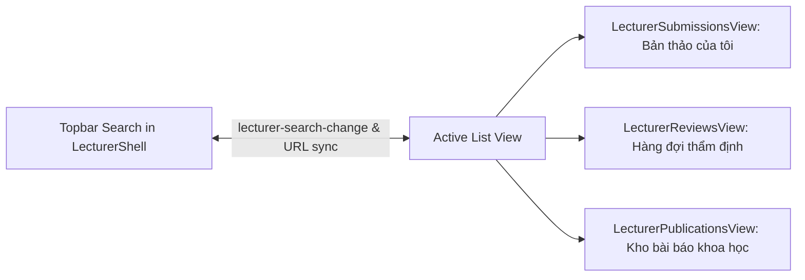

# Brainstorm: Triển khai Global Search & Đồng bộ 2 chiều cho Phân hệ Giảng viên (Lecturer)

**Ngày tạo**: 2026-09-21  
**Chủ đề**: Kích hoạt ô tìm kiếm Global trên Topbar của Giảng viên, hỗ trợ Instant Realtime Filter và Đồng bộ 2 chiều (Bi-directional Sync) hoàn hảo cho cả 3 trang: Bản thảo của tôi, Hàng đợi thẩm định và Kho bài báo khoa học.

---

## 1. Hiện trạng Codebase & Vấn đề Cần giải quyết

Sau khi hoàn thành tính năng tìm kiếm realtime và đồng bộ 2 chiều cho phân hệ Sinh viên (`Student Workspace`), phân hệ Giảng viên (`Lecturer Workspace`) hiện đang gặp tình trạng tương tự:

1. **Thanh Topbar của Giảng viên (`LecturerShell.tsx`)**:
   - Ô tìm kiếm hiện là thẻ HTML tĩnh (`dummy input`), chưa có xử lý sự kiện `onChange`, `onSubmit`, chưa kết nối URL hay các bảng dữ liệu.
2. **Các trang danh sách nghiệp vụ của Giảng viên**:
   - **Bản thảo của tôi** (`LecturerSubmissionsView.tsx`): Có thanh toolbar search cục bộ lọc tiêu đề/tóm tắt/từ khóa, nhưng dùng `type="search"` (dễ bị đúp 2 dấu `x`), chưa nhận từ khóa từ Topbar và chưa đồng bộ ngược lại Topbar/URL.
   - **Hàng đợi thẩm định** (`LecturerReviewsView.tsx`): Có thanh toolbar search cục bộ lọc tiêu đề/tác giả/DOI, dùng `type="search"`, chưa kết nối Topbar và URL query.
   - **Kho bài báo khoa học** (`LecturerPublicationsView.tsx`): Có thanh search cục bộ đa năng lọc theo tiêu đề/tác giả/tóm tắt/DOI, nhưng hoàn toàn độc lập với Topbar.
3. **Trải nghiệm người dùng thiếu nhất quán**:
   - Giảng viên gõ tìm kiếm ở thanh Topbar thì không có phản ứng gì.
   - Khi chuyển đổi giữa các trang hoặc làm mới trình duyệt, từ khóa tìm kiếm bị mất nếu không lưu trên URL.

---

## 2. Phương án Thiết kế Đã Thống nhất (Phương án 1)

Triển khai kiến trúc **Bi-directional Sync + Instant Realtime Filter** thống nhất toàn phân hệ Giảng viên:

### A. Kích hoạt Topbar Search trong `LecturerShell.tsx`
- Tách ô search thành sub-component `LecturerTopbarSearch` bọc trong `<Suspense>`.
- Chuyển `type="text"`, loại bỏ hoàn toàn nút cancel mặc định của trình duyệt để tránh lỗi đúp 2 dấu `x x`.
- Tích hợp nút `×` xóa nhanh giao diện đồng bộ.
- Đọc query param `?search=...` (hoặc `?q=...`) khi khởi tạo trang.
- Lắng nghe CustomEvent `lecturer-search-change` để đồng bộ giá trị khi người dùng gõ ở thanh toolbar của bảng.
- **Xử lý Realtime khi gõ**:
  - Khi đang ở 1 trong 3 trang danh sách (`/lecturer/submissions`, `/lecturer/reviews`, `/lecturer/publications`):
    - Phát sự kiện `lecturer-search-change` ngay lập tức để bảng lọc dữ liệu tức thì (0ms latency, không cần nhấn Enter).
    - Cập nhật URL bằng `window.history.replaceState` mà không làm reload trang.
  - Khi đang ở trang chi tiết hoặc hồ sơ (`/lecturer/profile`, `/lecturer/submissions/:id`, `/lecturer/reviews/:id`...):
    - Khi người dùng gõ từ khóa và nhấn `Enter` (hoặc click icon Search): Điều hướng tự động về trang danh sách phù hợp kèm `?search=...`.

### B. Đồng bộ 2 chiều tại 3 trang danh sách

1. **Bản thảo của tôi (`LecturerSubmissionsView.tsx`)**:
   - Đọc query search ban đầu từ URL `searchParams`.
   - Lắng nghe `lecturer-search-change` để cập nhật state `searchQuery`.
   - Khi gõ ở ô toolbar: Cập nhật state, phát sự kiện `lecturer-search-change` và cập nhật URL.
   - Đổi `type="search"` sang `type="text"` để triệt tiêu lỗi 2 dấu `x`.
2. **Hàng đợi thẩm định (`LecturerReviewsView.tsx`)**:
   - Tương tự, tích hợp 2 chiều với event `lecturer-search-change` và URL.
   - Đổi `type="search"` sang `type="text"`.
   - Lọc ngay theo tiêu đề bản thảo, tên tác giả, email người nộp và mã DOI.
3. **Kho bài báo khoa học (`LecturerPublicationsView.tsx`)**:
   - Tích hợp 2 chiều với event `lecturer-search-change` và URL.
   - Khi người dùng tìm kiếm ở Topbar hoặc Toolbar, danh sách bài báo lọc tức thì theo tiêu đề, tác giả, tóm tắt, DOI, từ khóa.

### C. Bổ sung Chuyển đổi Song ngữ (`LanguageSwitcher`) trên Topbar
- Tích hợp `<LanguageSwitcher variant="minimal" />` hoặc phù hợp lên Topbar của `LecturerShell.tsx`, đặt cạnh `NotificationBell` để đồng bộ nhận diện với phân hệ Student.

---

## 3. Tiêu chí Chấp thuận (Acceptance Criteria)

1. **Không còn đúp dấu `x`**: Trên tất cả các ô tìm kiếm (Topbar và Toolbar của cả 3 trang), chỉ xuất hiện duy nhất 1 nút `×` tùy chỉnh rõ nét, sạch sẽ.
2. **Instant Realtime Filter**: Gõ ký tự bất kỳ ở Topbar hoặc Toolbar -> bảng danh sách lọc ngay lập tức mà không cần nhấn phím Enter.
3. **Đồng bộ 2 chiều (Bi-directional Sync)**:
   - Gõ ở Topbar -> Toolbar tự động điền theo và bảng lọc theo.
   - Gõ ở Toolbar -> Topbar tự động cập nhật theo và URL đồng bộ theo `?search=...`.
   - Bấm `×` ở bất kỳ ô nào -> Cả 2 ô đều reset về rỗng, bảng hiển thị lại đầy đủ dữ liệu, URL xóa sạch param search.
4. **Điều hướng thông minh từ trang con**: Đang ở `/lecturer/profile` hoặc `/lecturer/reviews/:id`, gõ vào Topbar và ấn Enter -> chuyển hướng đúng về trang danh sách tương ứng kèm từ khóa tìm kiếm.
5. **Độ ổn định mã nguồn**: Typecheck `npx tsc --noEmit` đạt 0 lỗi, build trang thành công 100%.

---

## 4. Bước tiếp theo

- Chuyển sang bước lập kế hoạch thực hiện (`hs:plan`) chi tiết trước khi tiến hành chỉnh sửa mã nguồn.
